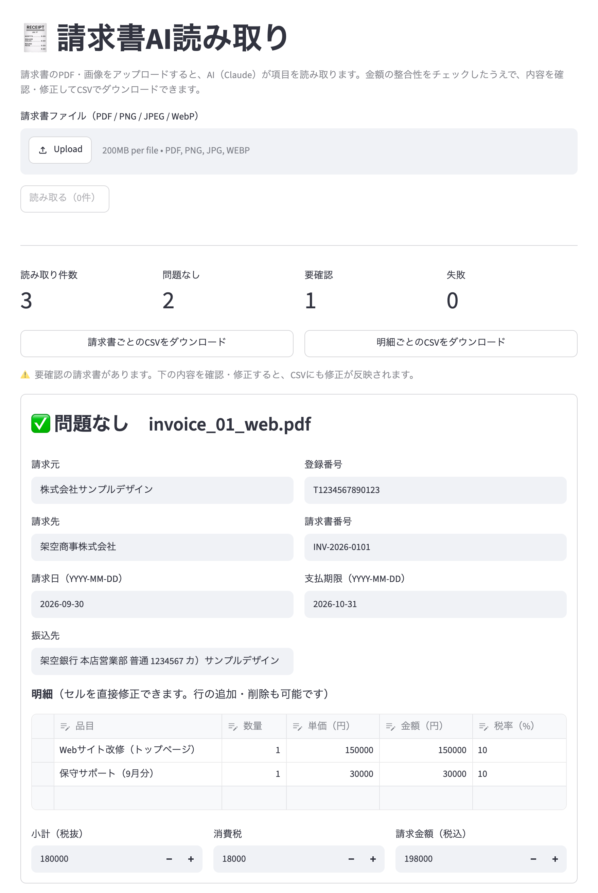
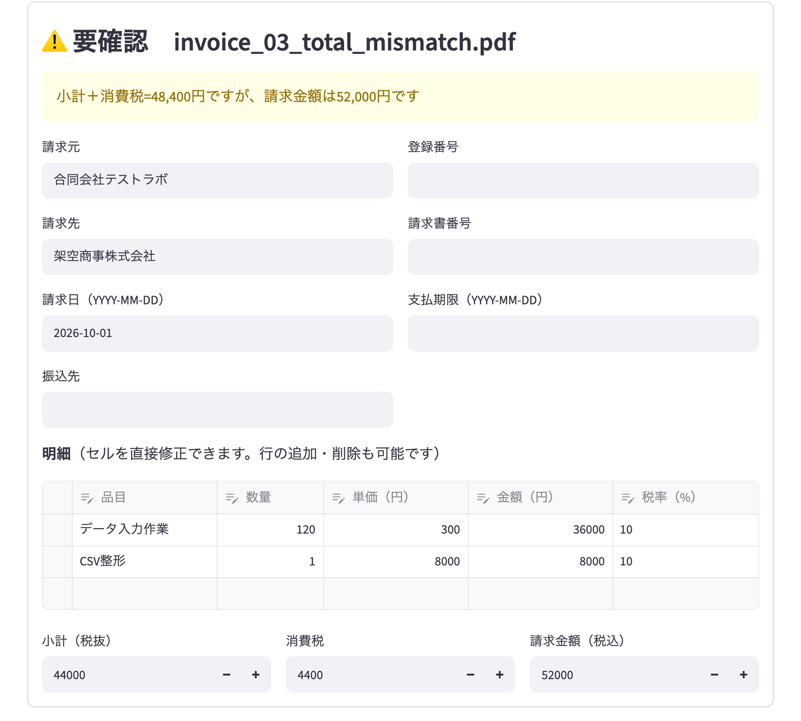

# invoice_extractor — 請求書AI読み取りツール



## 課題
取引先から届く請求書（PDF・紙のスキャン）を、経理担当者が1件ずつ見ながらExcelや会計ソフトに手入力している。件数が多いと時間がかかり、入力ミスや請求書側の計算ミスの見落としも起きやすい。

## 実装内容
請求書のPDF・画像をアップロードすると、Claude APIが項目を読み取り、金額の整合性をプログラムでチェックしたうえで、画面で確認・修正してCSVに出力するツール。

- **読み取る項目**：請求元・登録番号（インボイス）・請求先・請求書番号・請求日・支払期限・明細（品目・数量・単価・金額・税率）・小計・消費税・請求金額・振込先
- **対応ファイル**：PDF（紙をスキャンしたものを含む）、PNG、JPEG、WebP
- **出力**：請求書ごとのCSVと、明細ごとのCSV（Excelで開いても文字化けしないBOM付きUTF-8）
- **画面（Streamlit）**と**コマンド（CLI）**の両方で使える

### 金額の整合性チェック
AIには書類の値を「そのまま」読み取らせ、計算の誤りはプログラムで見つける。合わない請求書には「⚠️ 要確認」の印が付き、画面で直すとその場で再チェックされる。

- 数量 × 単価 ＝ 金額
- 明細の合計 ＝ 小計
- 税率ごとの消費税（10%・軽減税率8%が混在していても、インボイス制度のルールどおり税率ごとに計算）
- 小計 ＋ 消費税 ＝ 請求金額
- 請求日と支払期限の前後関係



## 実行例

### 画面
```bash
python -m streamlit run app.py
```
「サンプルの請求書（架空のデータ3枚）で試す」にチェックを入れて「読み取る」を押すと、すぐに試せる。

### コマンド
```bash
python extract.py samples -o result.csv
```

```
[info] 処理中 1/3: invoice_01_web.pdf
[info] 処理中 2/3: invoice_02_mixed_tax.pdf
[info] 処理中 3/3: invoice_03_total_mismatch.pdf
[info] トークン使用量: … / 警告1件
[done] 3件を処理（問題なし2 / 要確認1 / 失敗0）し、result.csv に出力しました。
```

サンプル3枚（`samples/`、`make_samples.py` で生成した架空の請求書）での結果：

| ファイル | 内容 | 結果 |
|---|---|---|
| invoice_01_web.pdf | 一般的な請求書 | ✅ 問題なし |
| invoice_02_mixed_tax.pdf | 8%と10%の混在、和暦（令和8年）の日付 | ✅ 問題なし（和暦は西暦に変換） |
| invoice_03_total_mismatch.pdf | わざと請求金額を間違えたもの | ⚠️ 要確認「小計＋消費税=48,400円ですが、請求金額は52,000円です」 |

## 使用技術
- Python
- Anthropic API（Claude）— PDF・画像入力、構造化出力（`messages.parse` + Pydantic）
- Streamlit（画面）、pandas
- reportlab（サンプル請求書の生成）

## 工夫した点
- **読み取りとチェックの役割分担**：AIに計算させず書類の値をそのまま転記させることで、請求書側の計算ミスも「要確認」として検出できる
- **出力形式の保証**：Pydanticで項目を定義し、構造化出力で受け取るため、JSONの崩れに対する後処理が不要
- **人が最終確認する流れ**：AIの結果をそのまま登録せず、画面で確認・修正してから出力する
- **1件の失敗で止まらない**：複数ファイルの処理中に1件失敗しても、理由を一覧に残して残りの処理を続ける
- **API呼び出しの節約**：画面ではファイルの中身のハッシュで読み取り結果を保持し、画面を操作するたびにAPIを呼ばない

## セットアップ
```bash
pip install -r requirements.txt
```

`.env` に以下を設定：
```
ANTHROPIC_API_KEY=sk-ant-xxxxxxxxxxxx
# 任意：使うモデルを変える場合（既定は claude-opus-5-5）
CLAUDE_MODEL=claude-sonnet-5-5
```

サンプルの請求書を作り直す場合：
```bash
python make_samples.py
```
